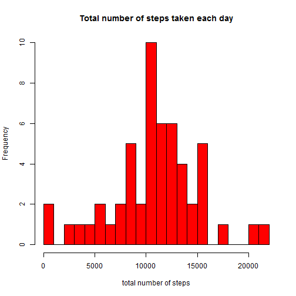

# Reproducible Research : Assignment 1

## Loading and preprocessing the data
First, the activity monitoring data set is loaded into a data frame variable.

```r
data <- read.csv("activity/activity.csv")
```
This data frame consists of three columns:
* steps: Number of steps taking in a 5-minute interval (including missing values coded as NA)
* date: The date on which the measurement was taken in YYYY-MM-DD format
* interval: Identifier for the 5-minute interval in which measurement was taken.

## What is mean total number of steps taken per day?
Here is a histogram of the total number of steps taken each day. The missing values are ignored.

```r
spd <- aggregate(data$steps,by=list(data$date),FUN=sum)
hist(spd$x,breaks=16, col="red", 
  main="Total number of steps taken each day", 
  xlab="total number of steps")
```

 

```r
meanSpd <- mean(spd$x,na.rm=TRUE)
medSpd <- median(spd$x, na.rm=TRUE)
```
We find the  mean and median tola number of steps take per day are **1.0766 &times; 10<sup>4</sup>** and the median is **10765**, respectively.

## What is the average daily activity pattern?
Here is a time series plot of the 5-minute interval and the average number of steps taken across all day:

```r
avdp <- aggregate(data$steps,by=list(interval=data$interval),FUN=mean, na.rm=TRUE)
plot(avdp$interval, avdp$x, type="l",
  main="Average number of steps taken across all days",
  xlab="5-minute interval id", ylab="number of steps")
```

 

```r
mint <- avdp[avdp$x == max(avdp$x),"interval"]
```
The 5-minute interval identifier that contains the maximum number of steps is **835**.
## Imputing missing values


```r
naRow <- sum(is.na(data$steps))
```
The number of missing data in the steps column is **2304**, which might affect the results.
We introduce a strategy filling in all of the missing values in the data set, using the mean
for the corresponding 5-minute interval, and create a new data set  with the missing data filled in.


```r
dataAdj <- data
for (i in 1:nrow(dataAdj)) {
  dataAdj[i,"steps"] <- ifelse(is.na(dataAdj[i,"steps"]),
                               avdp[avdp$interval == dataAdj[i,"interval"],"x"],
                               dataAdj[i,"steps"])

}
```
Here is a histogram of the total number of steps taken each day, caliculated based on the new data set.

```r
spdAdj <- aggregate(dataAdj$steps,by=list(dataAdj$date),FUN=sum)

hist(spdAdj$x,breaks=16, col="blue", 
     main="Total number of steps taken each day(after inputting missing data)",
     xlab="total number of steps")
```

 

```r
meanSpdAdj <- mean(spdAdj$x)
medSpdAdj <- median(spdAdj$x)
```
The mean and median tola number of steps take per day are **1.0766 &times; 10<sup>4</sup>** and **1.0766 &times; 10<sup>4</sup>**,
respectively. This shows the impact of imputting missing data on the estimates of the total daily number of steps is very negligible.

## Are there differences in activity patterns between weekdays and weekends?
We show two time series plots of the 5 minute interval and the average number of steps taken,each is averaged across all weekday days or weekend days.

```r
Sys.setlocale("LC_TIME","C")
```


```r
dataAdj$category <- as.factor(ifelse(weekdays(as.Date(dataAdj$date)) == "Sunday" | 
                                       weekdays(as.Date(dataAdj$date)) == "Saturday",
                              "weekends",
                              "weekdays"))
wdAvdp <- aggregate(dataAdj$steps,
                    by=list(interval=dataAdj$interval,category=dataAdj$category),
                    FUN=mean)
par(mfrow=c(2,1))
with(subset(wdAvdp,wdAvdp$category == "weekdays"),
     plot(interval,x,type="l",
          main="Activity patterns during weekdays",
          xlab="5 minute interval id",
          ylab="average number of steps",
          ylim=range(wdAvdp$x)
          )
     )
with(subset(wdAvdp,wdAvdp$category == "weekends"),
     plot(interval,x,type="l",
          main="Activity patterns during weekends",
          xlab="5 minute interval id",
          ylab="average number of steps",
          ylim=range(wdAvdp$x)
          )
     )
```

 

We found that there are differences in activity patterns between weekdays and weekends. During the weekdays, the peak activity period is found in the morning. On the other hand, we see more than one peaks over the day time during weekends.
